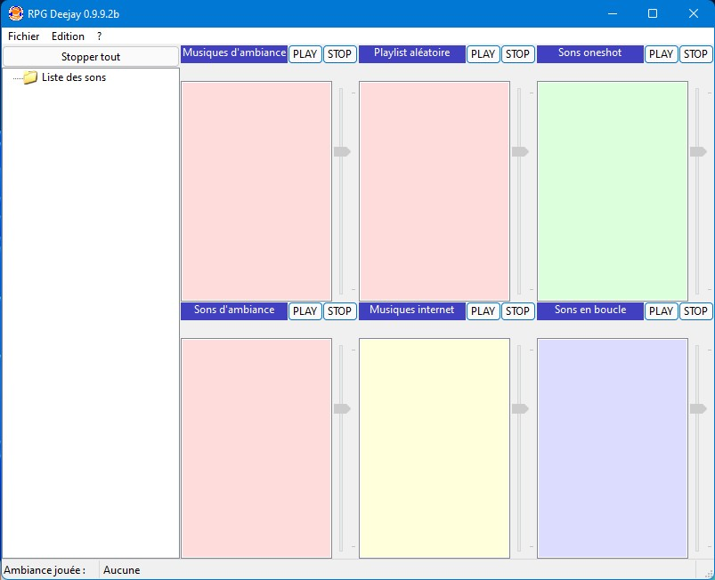

# RPG-Deejay
RPG Deejay est une console de mixage pour vos Jeux de rôles papier.

Il est aussi possible, si l'on installe une cable audio virtuel tierce, de partager le son de son ordinateur sur TeamSpeak, afin de jouer en ligne avec ses amis.
https://www.youtube.com/watch?v=NayWR1CDjCw

Le logiciel est presque entièrement développé pour ce qui est de la base, et peut être éventuellement amélioré si je reçois de bonnes suggestions.
Le fichier d'aide est encore en travaux.

Enjoy ;)
